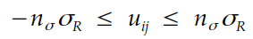

# Table of Contents

- [Region growing](#region_growing)
- [Howto](#howto)

# region_growing
A routine that implements a region growing algorithm based on mathematical morphology.

# Concepts
Region growing is a classical technique in which, based on the properties of an initial ("seed") point, pixels from its neighborhoods are labeled as pertaining or not pertaining to a region. The processs is carried out iteratively, until there is no more any noticeable change in the classified ("binarized") image.
While the decision criterion varies from application to application, here a pixel is considered to belong to a region if its value obeys the following condition



in which `n_sigma` is the number of standard-deviations that spans the interval. The key measurement, however, relates to `sigma_R`, which corresponds to the standard-deviation of region R inner pixels. This value is obtained over pixel intensities, and doesn't carry any spatial information.

There are different ways to update the region itself. One of the most common occurs by means of a queuing process, in which a list of coordinates is iterated and updated according a [FIFO](https://en.wikipedia.org/wiki/FIFO_(computing_and_electronics)) procedure. Here, we take a different path, and appeal to a simple procedure based on binary masking and [morphological dilation](https://en.wikipedia.org/wiki/Mathematical_morphology#Dilation). The idea is quite simple:
* dilate the image containing the region (the seed in the very first iteration);
* apply a mask over the image, in order to preserve only those pixels that fullfil the criterion shown in the equation above; and
* continue until there is no more changes in the region.

Of course, using this approach puts some questions on the table: which [structuring element](https://en.wikipedia.org/wiki/Mathematical_morphology#Structuring_element) should be used? Masking will consider values that are eventually lie outside the region? If this is the case, what happens? etc. However, using mathematical morphology allows us to contemplate the power and flexibility of this paradigm, which seems to be overlooked nowadays.

# Howto
The code possess three input parameters that must be passed by flags
| flag          | default value | description |
|---------------|---------------|-------------|
| `-path_input` | `""`          | **absolute** path to the input image |
| `-path_output`| `""`          | **absolute** path to the output directory, where sequence frames are to be saved |
| `-num_sigma`  | `3`           | the number of sigma (standard deviation; please see explanation above) that spans the interval of analysis |
| `-sigma_noise`| `0.`          | noise standard deviation, used to corrupt the image |

In order to execute this study, the user must call Python through the command line, passing the parameters via flags. An example would be
```
python3 main.py -path_input <path_to_input_image> -sigma_noise 0 -path_output <path_to_output_image>
```
Notice that the order of the flags is immaterial. The script will parse them properly.
